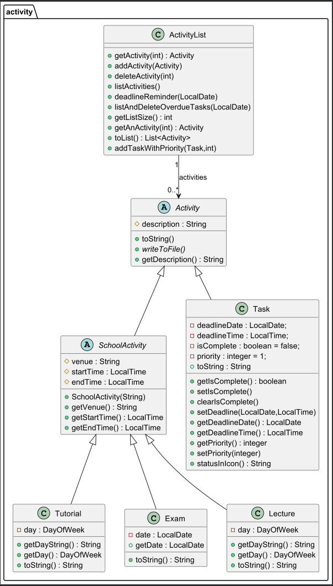

# Developer Guide

## Acknowledgements

This Developer Guide builds upon the SE-EDU AB3 template and guidelines. We use PlantUML for diagrams. Any reused ideas are adapted and cited inline where applicable.

## Design & implementation - activity package
This section shows the classes stored in the activity package and how they are associated to each other

### Overview
The activity package defines the core domain model of the ASTRA application. It manages all user activities (e.g., tasks, tutorials, lectures, exams) and provides logic for creating, listing, and maintaining them through the ActivityList class.

Design Goals
- Provide a flexible abstraction for all types of activities.

- Support both academic activities (tutorials, lectures, exams) and personal tasks (assignments, projects etc).

- Centralize storage and management of activities using ActivityList.

- Facilitate extensibility — new activity types can be added easily by extending Activity.

### Architecture context (class diagram)
```plantuml
@startuml
'https://plantuml.com/class-diagram
package activity {

    abstract class Activity
    abstract class SchoolActivity
    class Task
    class Tutorial
    class Exam
    class ActivityList


    Activity <|-- Task
    Activity <|-- SchoolActivity
    SchoolActivity <|-- Lecture
    SchoolActivity <|-- Tutorial
    SchoolActivity <|-- Exam
    ActivityList "1" --> "0..*" Activity : activities


    class ActivityList {
    + getActivity(int) : Activity
    + addActivity(Activity)
    + deleteActivity(int)
    + listActivities()
    + deadlineReminder(LocalDate)
    + listAndDeleteOverdueTasks(LocalDate)
    + getListSize() : int
    + getAnActivity(int) : Activity
    + toList() : List<Activity>
    + addTaskWithPriority(Task,int)
    }


    abstract class Activity {
    # description : String
    + toString()
    + writeToFile() {abstract}
    + getDescription() : String
    }
    abstract class SchoolActivity {
    # venue : String
    # startTime : LocalTime
    # endTime : LocalTime
    + SchoolActivity(String)
    + getVenue() : String
    + getStartTime() : LocalTime
    + getEndTime() : LocalTime
    }

    class Tutorial {
    - day : DayOfWeek
    + getDayString() : String
    + getDay() : DayOfWeek
    + toString() : String
    }

    class Exam {
    - date : LocalDate
    + getDate : LocalDate
    + toString() : String
    }

    class Lecture {
    - day : DayOfWeek
    + getDayString() : String
    + getDay() : DayOfWeek
    +toString() : String
    }

    class Task {
    - deadlineDate : LocalDate;
    - deadlineTime : LocalTime;
    - isComplete : boolean  = false;
    - priority : integer = 1;
    + getIsComplete() : boolean
    + setIsComplete()
    + clearIsComplete()
    + setDeadline(LocalDate,LocalTime)
    + getDeadlineDate() : LocalDate
    + getDeadlineTime() : LocalTime
    + getPriority() : integer
    + setPriority(integer)
    + toString : String
    + statusInIcon() : String
    }
}


@enduml
```

